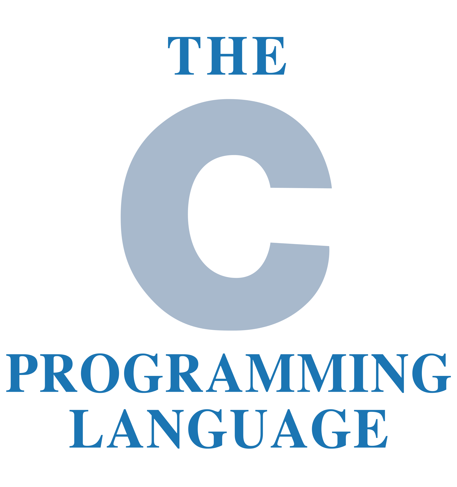
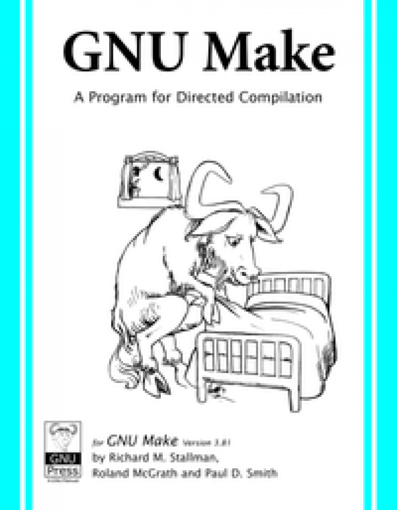

# How to write C in 2016

Matt wrote a very interesting and totally recommended post about [*how to C (as
of 2016)](https://matt.sh/howto-c). Keith Thompson wrote later a very detailed
and rather useful
[critique](https://github.com/Keith-S-Thompson/how-to-c-response/blob/master/README.md)
with some extra notes about Matt's post.

Go a head and read both articles right now!

Here I would like to point out some things about tooling.

## Use building tools (Make, Autotools, CMake)

This might be obvious for most C programmers, but I've seen quite a lot of
people, novices specially, copying and pasting the compilation command on each
iteration.

Using a build tool will allow you to automate the building process, but also
testing, distribution package generation, etc.

In order to sanely write C code the bear minimum you need is to know and feel
comfortable [writing](http://mrbook.org/blog/tutorials/make/) and
[using](http://www.cs.colby.edu/maxwell/courses/tutorials/maketutor/)
*makefiles*, so the compilation process can be described like in a recipe and
triggered by issuing the `$ make` command.

Using [make](https://www.gnu.org/software/make/) alone by writing *makefiles*
will take you pretty far, but for larger software you might want to automate
even further all the software ecosystem, so your code can examine the target
system for both static and dynamic libraries, binaries available and configure
it self to adapt to the system and be as portable as possible.
[Autotools](https://www.gnu.org/software/automake/manual/html_node/Autotools-Introduction.html)
to the rescue.

[Learning](https://autotools.io/index.html) and
[using](https://www.sourceware.org/autobook/autobook/autobook.html#Top)
*Autotools* is not much of a trivial task, but when the complexity in your code
starts to get out of hand, taking the effort to use them is worth it!

If your code is needs not only to be Posix systems portable, but also get
compiled on Windows machines, [CMake](https://cmake.org/) rocks!

## Use a linter

A *linter* in case you don't know, is a program that will statically check the
**source code** (not the executable) to find any known non-portable constructs,
vulnerabilities from common programming mistakes and/or bad practices and any
other general coding mistakes that can make your program leak memory, step on
segmentation faults and the like.

[Splint](http://www.splint.org/) is an awesome piece of software that will tell
you a **lot** about what your code might be doing wrong.

You can use it very easily just by specifying the source files like:

    $ splint foo.c bar.c

Most of the *splint* output will be more than suggestions than critical
warnings, but following the *splint* recommendations with poise will make your
code more robust.

You can tune the level of paranoia with the *splint* argument options: `-weak`,
`-standard`, `-cheks` and `-strict`

## Valgrind

[Valgrind](http://valgrind.org/) is a profiling software with a few neat tricks
up the sleeve. In contrast to *splint*, it will use your **executable program**
and will help you finding memory leaks, make your programs faster and more
correct.

When compiling your program use the `-g` compiler flag so extra debugging
information is include in the executable.

Then you can execute you program with Valgrind like this:

    $ valgrind foobar arg1 arg2

That will use the `Memcheck` tool, one of multiple [Valgrind
tools](http://valgrind.org/docs/manual/manual.html).

## Use a debugger

Yeah sure, you can fill up you code with `printf` calls for debugging and pretty
much get away with it, but 

## Use a control version system

You might think you can get away keeping a ton of directories for each version
of your program if it is small but that will, eventually, byte you!

A control version system will give you a few super powers for collaboration,
version restoring, multi branching, proper history tracking, back up and so much
more.

You could use [CVS](http://www.nongnu.org/cvs/) or [SVN
(Subversion)](https://subversion.apache.org/), but why to do so if you can use a
much more powerful control version system like
[Mercurial](https://www.mercurial-scm.org/wiki/) or even better
[Git](https://git-scm.com/).

On top of that, even if you're working alone in a project and won't collaborate
with more people, using a repository hosting service like
[Bitbucket](https://bitbucket.org/) or [Github](https://github.com/) is a great
way to always have a backup of your code. In the future if more people join to
your project, collaboration will be frictionless.

## Learn functional programming language

Learning to think functionally will improve your C code despite C being an
imperative language, you'll stop using mutable global state, and all the kind of
stuff that prevent your software from being multi thread safe.

If you work on embedded software, you're probably writing in C. Considering that
even relatively cheap embedded hardware today have more than one core,
parallelism is pretty important and functional programing mind set will help a
lot to do it well.

There are quite a few multi paradigm languages out there, like python, but if
I have to give a recommendation I would say: Learn a pure
functional programming language. Specially, [blow your mind with
Haskell!](https://www.haskell.org/)

## Don't write in C

Eric Raymond [said](http://www.catb.org/esr/faqs/hacker-howto.html):

> The more you can avoid programming in C the more productive you will be.

And a lot of people say similar things, but I **disagree**. C is a great and
powerful language, but with a great power comes a great responsibility. You
don't need to **avoid it**, instead use C when you need and can take advantage
of its power and you can afford the effort it takes handling all the extra
responsibility that power comes with.

Depending on what you're doing some other languages would probably fit better
and give you extra abstraction in exchange of some perforce decrement. In most
cases when you think you need C you probably can also do it well with
[Rust](https://www.rust-lang.org/) or [Go](https://golang.org/) (I recommend the
former) and get the work done with great performance and low level management
when needed.
